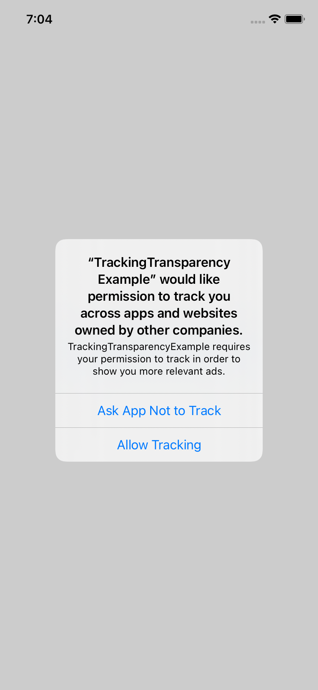

# react-native-tracking-transparency

🕵️ A React Native Library for interacting with the tracking API from iOS 14.

<br />
<br />
<p align="center">
  
  
</p>
<br />
<br />

## Installation

1. Install package
    ```sh
    npm install react-native-tracking-transparency
    cd ios
    pod install
    ```

2. Add `NSUserTrackingUsageDescription` to your `Info.plist`

## Usage

See the [example](example/) app for a full code example.

### getTrackingStatus

Gets the current Tracking API status. As of iOS 14, Apple requires apps to only enable tracking (e.g.: advertiser ID collection) when the user has granted tracking permissions.

> Requires iOS 14. On Android and iOS versions below 14, this will always return `'unavailable'`.

```js
import { getTrackingStatus } from 'react-native-tracking-transparency';

const trackingStatus = await getTrackingStatus();
if (trackingStatus === 'authorized' || trackingStatus === 'unavailable') {
  // enable tracking features
}
```

The tracking status can return one of the following values:

* `'unavailable'`: The tracking API is not available on the current device. That's the case on Android devices and iPhones below iOS 14.
* `'denied'`: The user has explicitly denied permission to track. You'd want to respect that and disable any tracking features in your app.
* `'authorized'`: The user has granted permission to track. You can now enable tracking features in your app.
* `'restricted'`: The tracking permission alert cannot be shown, because the device is restricted. See [`ATTrackingManager.AuthorizationStatus.restricted`](https://developer.apple.com/documentation/apptrackingtransparency/attrackingmanager/authorizationstatus/restricted) for more information.
* `'not-determined'`: The user has not been asked to grant tracking permissions yet. Call `requestTrackingPermission()`.

### requestTrackingPermission

Requests permission to track the user. Requires an [`NSUserTrackingUsageDescription`](https://developer.apple.com/documentation/bundleresources/information_property_list/nsusertrackingusagedescription) key in your `Info.plist`. (See [iOS 14 Tracking API](https://developer.apple.com/documentation/apptrackingtransparency))

> Requires iOS 14. On Android and iOS versions below 14, this will always return `'unavailable'`.

```js
import { requestTrackingPermission } from 'react-native-tracking-transparency';

const trackingStatus = await requestTrackingPermission();
if (trackingStatus === 'authorized' || trackingStatus === 'unavailable') {
  // enable tracking features
}
```

## Contributing

See the [contributing guide](CONTRIBUTING.md) to learn how to contribute to the repository and the development workflow.

## License

MIT
